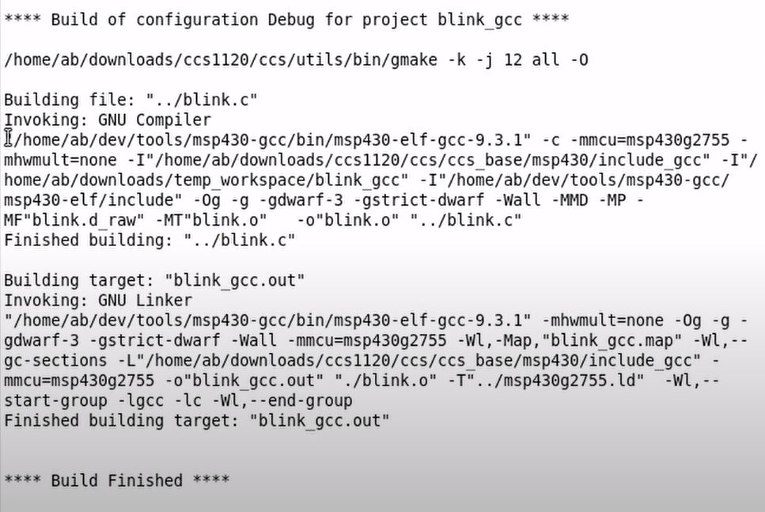

# link
https://www.youtube.com/watch?v=HCfq44NNBaU&t=2682s

# Get started
**IDE** is a gui wrapper.
**Toolchain** consists of compiler, debugger and linker...
Several toolchain exists like ti, gcc, llvm, iar,...
_____
in this video: toolchain gcc in makefile.
CI testing using ide is not possible.
___
# Tool chain
**GCC:**
- part of gnu toolchain
- widely used (eg. linux Kernel)
- Supports many targets (x86, ARM,...)
- Open source and free
- Well documented

**Third Party compnies**
- IAR systems, keil, crossworks, ...
- they provide complete development environments including toolchain
- smaller faster binaries
- special ide features
- tech support
- expensive

# Prepare MSP toolchain for GCC
- download gcc toolchain from ti web
- unpack it.
- all the tools are available inside the folder
- blinky exaple in msp
- Append the current working directory to the PATH
´PATH="$PATH:$(pwd)"` \
pwd is current dir (where all the tools are available)

- we can directly *run msp-elf-gcc main.c*
___
- -I is for include path
- -mmcu for defining mcu
- linker script (**.ld**) define memory layout of microcontroller (it will be located at the dir where compiler is located)
- I-L is path to linker

- blink is a binary
- generate binary using gui tool  looks like:

_________
# decoding compiler script

- -c run the compiler seperatly
- -mhwmult=none is no hardware multiplier  in mcu
- -Og is optimization. it can be 0,1,2,3, g for debugger
- -g tells the compiler to add relevent debug information for debugger gdb, gdb is a debugger which is part of gcc toolchain
- -Wall compiler tells the warning
- -Wall (-Werror all the warning error ) (-Wshadow if same name used for inner and outer scope variables)
- 
___
# makefile

# create make file
- use tab for next line
 

- simplest make file

___
1. Make the variables:

2. Seprate the variable (more compiler flags)

- add prefix: For example, we have a list of source files (file1.c, file2.c, file3.c). We use the addprefix function to add the prefix "obj_" to each source file name, resulting in a list of object file targets (obj_file1.o, obj_file2.o, obj_file3.o).

3. Seprate compilation and linking stage:
because it uses to compile which is changed, not to compile all files.

1st buil then link

4. Pattern rule: writing compilation for every file :(
    % is any input
    

5. Files in seprate directory
    
    

 

